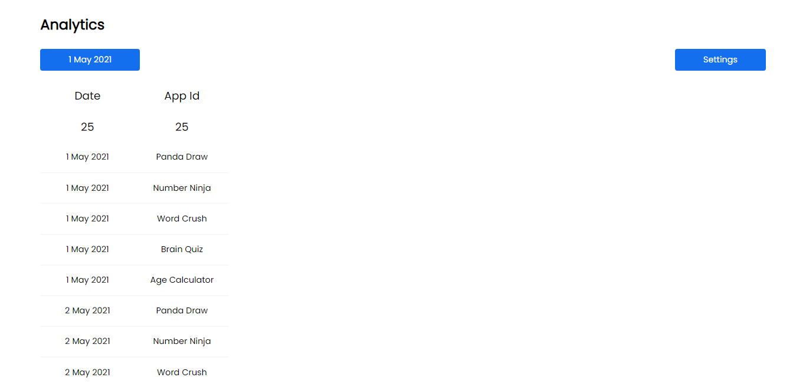
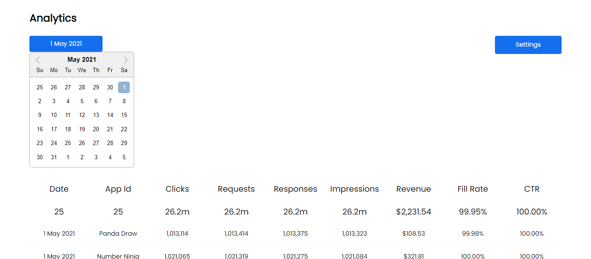
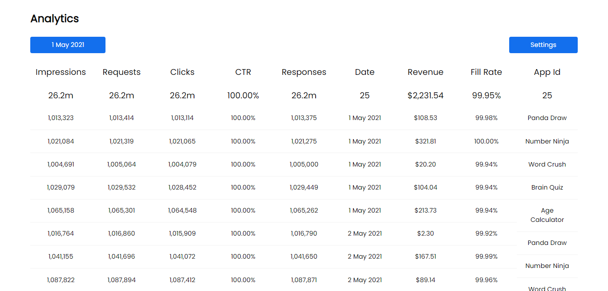
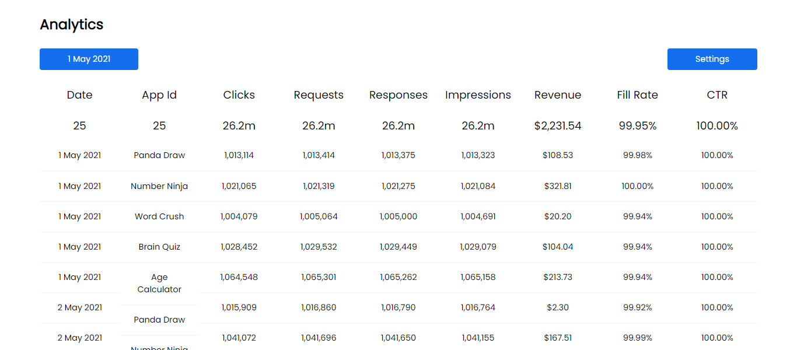

[](https://app.netlify.com/sites/debarshib-analytics/deploys)

# ImageGram

A responsive image sharing web app.

## Demo

[Deployed on Netlify using github actions](https://debarshib-analytics.netlify.app/)

## Features:

- Order/re-order columns based on order of filters
- Tabular representation of data
- Drag-Drop Features of filters
- Addition/removal of columns in real time
- Fetch data based on calender dates
- Uses _memoized selectors_ to cache and optimize heavy computations
- Uses Redux to maintain data state

## Built using:

- [ReactJS](https://reactjs.org/) - Frontend framework
- [ReduxToolkit](https://redux-toolkit.js.org/) - Centralized state management
- [NumeralJS](http://numeraljs.com/) - A javascript library for formatting and manipulating numbers
- [MomentJS](https://momentjs.com/) - Parse, validate, manipulate, and display dates and times in JavaScript

## Screenshots

#### Desktop









<br/>

## Run Locally

- Clone the project
  ```
  git clone https://github.com/Debarshi95/Analytics.git
  ```
- Go to the project directory
- cd **analytics-board**
- Install dependencies
  ```
  yarn
  ```
- Create a **.env.local** file
- Create a project inside Google Firebase and export the configuration
- Add the following configuration to your .env file

  ```
  REACT_APP_BASE_URL="Provided Api base url"
  ```

- Start the server
  ```
  yarn start
  ```
